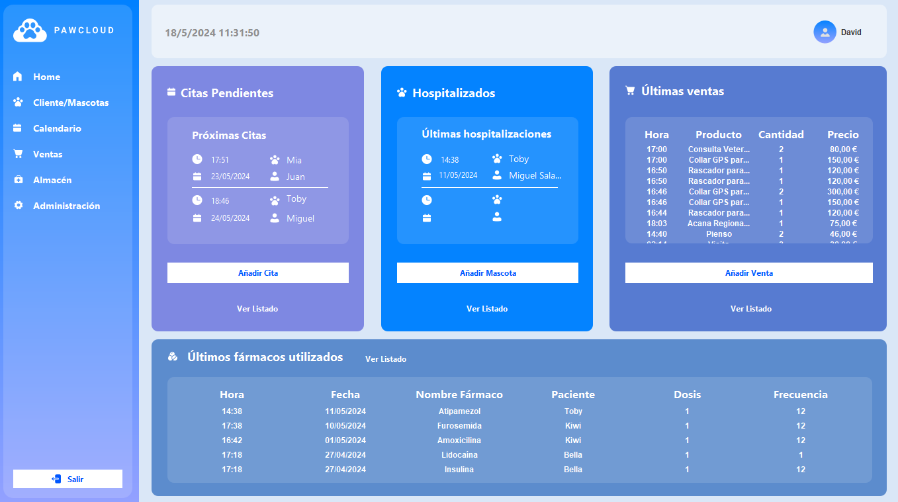
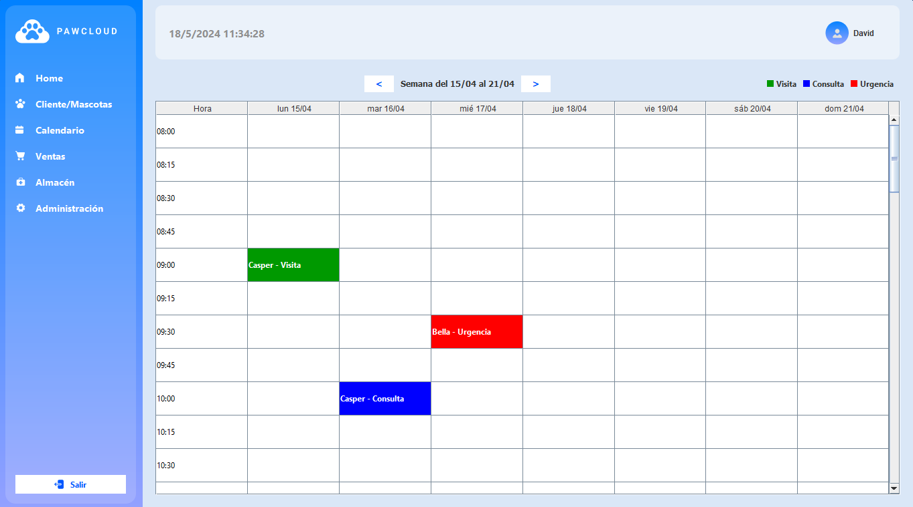
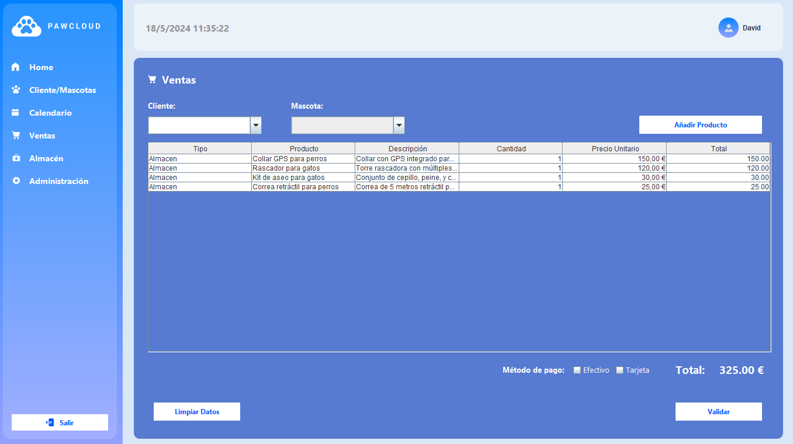

## PawCloud 

PawCloud es una aplicación diseñada para mejorar la gestión de clínicas veterinarias de pequeña escala. Esta herramienta está ideada para ser una solución económica para aquellos establecimientos veterinarios que necesitan optimizar sus recursos sin incurrir en los altos costos asociados con sistemas más complejos y extensos. Con PawCloud, las clínicas pueden manejar de manera eficiente aspectos cruciales como la programación de citas, el almacenamiento de registros médicos de los animales, y la gestión de inventarios y ventas.

Panel Principal:

Calendario:

Panel Ventas:

